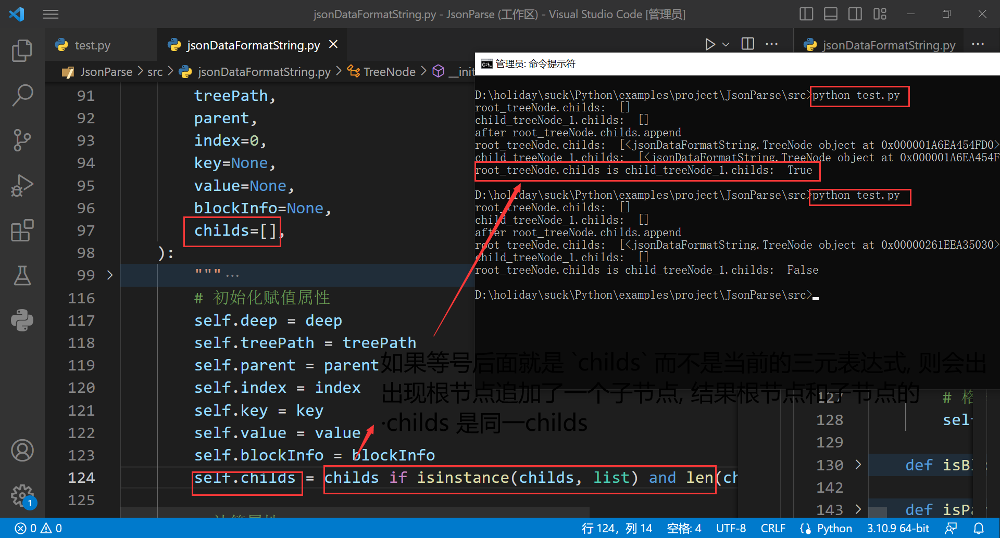

# 记录

## 教训
- 树形对象初始化器的默认值参数 在进行赋值时, 必须进行数组判断， 否则会出现怪异的问题

如下截图:

这个, 不起眼的小小错误, 花了1个半小时, 让我纠结排查半天了, 因为树根节点和子树节点的 `childs` 是同一个对象, 所以向下递归深度访问就是无限死循环。
可是谁会想到问题竟然出现在这里, 在 Python里 方法带默认值的参数, 在被调用时, 可以不传递该参数进行调用, 调用时会使用默认值。

还有如果加上了这个列表类型判断后, VSCode能自动感应到 `childs` 属性就是一个列表类型